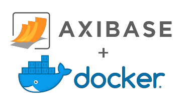

# Official ATSD Docker Image



## Overview

[Axibase Time Series Database](https://axibase.com/docs/atsd/) is a non-relational database optimized for collecting, storing, and analyzing temporal data from IT infrastructure, industrial equipment, smart meters, and IoT devices.

ATSD provides several tools for application developers and data scientists:

* [Network API](https://axibase.com/docs/atsd/api/network/), [CSV parsers](https://axibase.com/docs/atsd/parsers/csv/), [Storage Drivers](https://axibase.com/use-cases/integrations/cadvisor/), and [Axibase Collector](https://axibase.com/docs/axibase-collector/) to collect time series data.
* [Rest API](https://axibase.com/docs/atsd/api/data/) and API clients for integration with Python, Java, Go, Ruby, NodeJS applications and R scripts.
* [SQL Console](https://axibase.com/docs/atsd/sql/) with time series extensions for scheduled and ad-hoc reporting.
* Built-in declarative [visualization library](https://github.com/axibase/charts/blob/master/README.md) with 15 time series widgets.
* [Rule Engine](https://axibase.com/docs/atsd/rule-engine/) with support for analytical rules and anomaly detection based on ARIMA and Holt-Winters [forecasts](https://axibase.com/docs/atsd/forecasting/).

> Refer to [ATSD Documentation](https://axibase.com/docs/atsd/) for additional information.

## Image Summary

* Image Name: `axibase/atsd:latest`
* Base Image: Ubuntu `16.04`
* [Dockerfile](https://github.com/axibase/dockers/blob/master/Dockerfile)

## Launch Instructions

### Start Container

```sh
docker run \
  --detach \
  --name=atsd \
  --restart=always \
  --publish 8088:8088 \
  --publish 8443:8443 \
  --publish 8081:8081 \
  --publish 8082:8082/udp \
  axibase/atsd:latest
```

### Check Installation

Watch for `ATSD start completed` message at the end of the `start.log` file.

```sh
docker logs -f atsd
```

```txt
[ATSD] Starting ATSD ...
...
[ATSD] Waiting for ATSD to start. Checking ATSD user interface port 8088 ...
[ATSD] Waiting for ATSD to bind to port 8088 ...( 1 of 20 )
...
[ATSD] ATSD web interface:
[ATSD] http://172.17.0.2:8088
[ATSD] https://172.17.0.2:8443
[ATSD] ATSD start completed.
```

The user interface is accessible on HTTPS port `8443`.

### Launch Parameters

| **Name** | **Required** | **Description** |
|:---|:---|:---|
|`--detach` | Yes | Run container in the background and print container ID. |
|`--hostname` | No | Assign hostname to the container. |
|`--name` | No | Assign a unique name to the container. |
|`--restart` | No | Auto-restart policy. **Not supported in all Docker Engine versions.** |
|`--publish` | No | Publish container port to the host. |
|`--env` | No | Define [environment variables](#environment-variables) inside the container in `key=value` format. |

### Environment Variables

| **Name** | **Required** | **Description** |
|:---|:---|:---|
|`ADMIN_USER_NAME` | No | User name for the built-in administrator account. |
|`ADMIN_USER_PASSWORD` | No | [Password](https://axibase.com/docs/atsd/administration/user-authentication.html#password-requirements) for the built-in administrator.|
|`COLLECTOR_USER_NAME` | No | User name for a data [collector account](https://axibase.com/docs/atsd/administration/collector-account.html). |
|`COLLECTOR_USER_PASSWORD` | No | [Password](https://axibase.com/docs/atsd/administration/user-authentication.html#password-requirements) for a data collector account.|
|`COLLECTOR_USER_TYPE` | No | User group for a data collector account, default value is `writer`.|
|`DB_TIMEZONE` | No | Database [timezone identifier](https://axibase.com/docs/atsd/administration/timezone.html).|
|`JAVA_OPTS` | No | Additional arguments to be passed to ATSD JVM process. |
|`HADOOP_OPTS` | No | Additional arguments to be passed to Hadoop/HDFS JVM processes. |
|`HBASE_OPTS` | No | Additional arguments to be passed to HBase JVM processes. |

View additional launch examples [here](https://axibase.com/docs/atsd/installation/docker.html).

### Exposed Ports

| **Name** | **Protocol** | **Description** |
|:---|:---|:---|
| `8088` | HTTP | API and user interface. |
| `8443` | HTTPS | Secure API user interface. |
| `8081` | TCP | Incoming [network commands](https://axibase.com/docs/atsd/api/network/#connection). |
| `8082` | UDP | Incoming [network commands](https://axibase.com/docs/atsd/api/network/#udp-datagrams). |
| `8084` | TCP | Incoming Graphite commands in Python pickle format. |
| `1099` | TCP | JMX |

### Troubleshooting

Review [Troubleshooting Guide](https://axibase.com/docs/atsd/installation/troubleshooting.html).

### Validation

[Verify installation](https://axibase.com/docs/atsd/installation/verifying-installation.html).

## Post-installation Steps

* [Basic configuration](https://axibase.com/docs/atsd/installation/post-installation.html).
* [Getting Started Guide](hhttps://axibase.com/docs/atsd/tutorials/getting-started.html).
